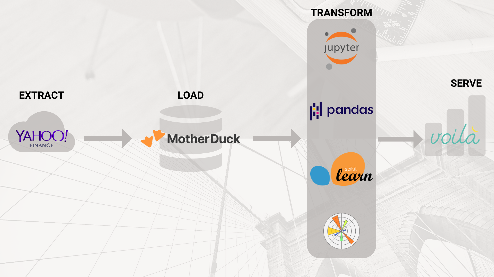

# *Hacktoberfest 2023*: Building an ETL Pipeline and utilizing Machine Learning for stock market predictions


## :jack_o_lantern: Introduction

[Ploomber](https://ploomber.io/) is a dynamic startup that's dedicated to revolutionizing the landscape of data pipeline development and deployment, accommodating various code editors like Jupyter Notebooks and VSCode. Beyond advancing technology, the Ploomber team is committed to fostering growth within the Data Science and Machine Learning community. 

In pursuit of this vision, they proudly initialized the celebrated Hacktoberfest 2023 event—a 5-week mentorship opportunity within a realistic project-based, open-source environment designed for 10 early-career hackers. This unique experience offers participants expert mentorship, hands-on development of production-ready projects, a deep dive into practical skills, networking opportunities within a passionate community, and the chance to contribute to open-source—all free of cost.

By the end of this program, participants will have had exposure and developed their skills in the following areas:
- Proficient in writing clean and reproducible code using SQL and Python.
- Expertise in package management.
- Capable of developing modularized applications.
- Familiarity with Dockerizing applications.
- Skilled in deploying applications using Ploomber Cloud.
- Strong communication skills for conveying data insights to stakeholders.


## :newspaper: Description

As part of Ploomber's Hacktober 2023 initiative, our project will focus on building an extract-load-transform (ELT) pipeline connecting the live stock market data from the `yfinance` API to our [Mother Duck](https://motherduck.com/) cloud warehouse. Our reason for approaching this challenge head-on was for the implicit payoff of honing our collective Data Science/Engineering skillset along with the opportunity for economic gain should we succeed in building an accurate model :money_mouth_face:

With the vast array of stock market data in our cloud infrastructure, we'll then fit various machine learning models to generate predictions on our dataset and deploying our model using Ploomber cloud.

## :chart_with_upwards_trend: Data sources

The bulk of our dataset will be scraped from the [yfinance](https://github.com/ranaroussi/yfinance) Python library which is an open-source tool that utilizes Yahoo's publicly available API with the intention of providing stock market data for research and educational purposes. The library was developed in response to Yahoo decomissioning their historical data but is not affiliated, endorsed, or vetted by Yahoo Inc in any way and is distributed under the [Apache Software Lisence](https://github.com/ranaroussi/yfinance/blob/main/LICENSE.txt).

The historical stock price data for a given ticker can be accessed by inputting the ticker symbol within the `Ticker()` module, followed by the `history()` method. Below is a vanilla code example to pull all the historical price activity for the [Alphabet Inc's (Google) Class A](https://finance.yahoo.com/quote/GOOG/) stock:

```
import yfinance as yf

googl = yf.Ticker("GOOGL")
df = google.history(period='max')
```

Below are the parameters available to specify the intervals from which you wish to pull stock data from:

- `period`: Specify the data period for download using either the "period" parameter or the "start" and "end" parameters. Valid periods include: `1d`, `5d`, `1mo`, `3mo`, `6mo`, `1y`, `2y`, `5y`, `10y`, `ytd`, `max`.
- `interval`: Define the data interval, keeping in mind that intraday data cannot extend beyond the last 60 days. Valid intervals are: `1m`, `2m`, `5m`, `15m`, `30m`, `60m`, `90m`, `1h`, `1d`, `5d`, `1wk`, `1mo`, `3mo`.
- `start`: When not using the "period" parameter, set the start date for download as a string (YYYY-MM-DD) or datetime using the "start" parameter.
- `end`: When not using the "period" parameter, set the end date for download as a string (YYYY-MM-DD) or datetime using the "end" parameter.
- `prepost`: Decide whether to include Pre and Post market data in the results by setting the "prepost" parameter (default is `False`).
- `auto_adjust`: Choose whether to automatically adjust all OHLC (Open, High, Low, Close) using the "auto_adjust" parameter (default is `True`).
- `actions`: Opt to download stock dividends and stock splits events by setting the "actions" parameter (default is `True`).


## :wrench: Methods 

To accomplish our end goal of building a model which forecasts stock market data, we needed to employ an **Extract, Load, Transform (ELT) architecture** for our data pipeline. ELT pipelines differ slightly from the conventional **Extract, Transform, Load (ETL) architecture** in that we clean and transform our data BEFORE we load it to the warehouse. With an ELT architecture, on the other hand, we can conduct the data cleaning and transformations within the data warehouse or another environment AFTER we've loaded the data. 

One of the main justifications for utilizing an ELT pipeline, rather than the conventional ETL architecture, is that the stock market data from the `yfinance` API was largely clean and standardized from the get-go. Therefore, to optimize on compute, we decided to load the data directly into a MotherDuck cloud warehouse where we can ensure scalability, accessibility, and efficient storage.

With the data loaded in a MotherDuck warehouse, the logical next step was to conduct the data cleaning, data visualization, and predictive modelling phases of the Data Science lifecycle in [Jupyter Notebook](https://jupyter.org/). As a fundamental tool amongst practicing Data Scientists, Jupyter Notebook enables users to directly access data from the cloud and experiment with different transformations, visualizations, and the training and testing of predictive models. And within our Jupyter Notebooks, our team utilized tools such as:

* The SQL programming language to query our database, 
* Python packages like:
    * [Pandas](https://pandas.pydata.org/) for data transformation, manipulation, and analysis;
    * [Matplotlib](https://matplotlib.org/stable/) and [Seaborn](https://seaborn.pydata.org/) for data visualization;
    * [Scikit-Learn](https://scikit-learn.org/stable/index.html#) for building machine learning models.
    * And [TensorFlow](https://www.tensorflow.org/) for building deep learning models.



Last but not least, the final stage of our project included the deployment of the work in our Jupyter Notebooks to a [Voila](https://voila-dashboards.github.io/) dashboard, using Ploomber and Docker containers. Voila is a bleeding-edge subproject within the Jupyter ecosystem which transforms static Python notebooks into standalone, interactive web applications. With Voila, we were able to save the outputs of our analysis and generate actionable insights.


## :busts_in_silhouette: Team members

With the help, guidance, and mentorship from [Laura Gutierrez Funderburk](https://github.com/lfunderburk) and the rest of the Ploomber team, the core contributors for this project include:

:star: [Zhiyi Chen](https://github.com/zhiyiyi)

:star: [Alice Liang](https://github.com/Aliceliangwk) 

:star: [Ruiz Rivera](https://github.com/vanislekahuna)


:incoming_envelope: Thank you for taking the time to review our project. Please feel free to contact us with any feedback, questions or comments you may have!